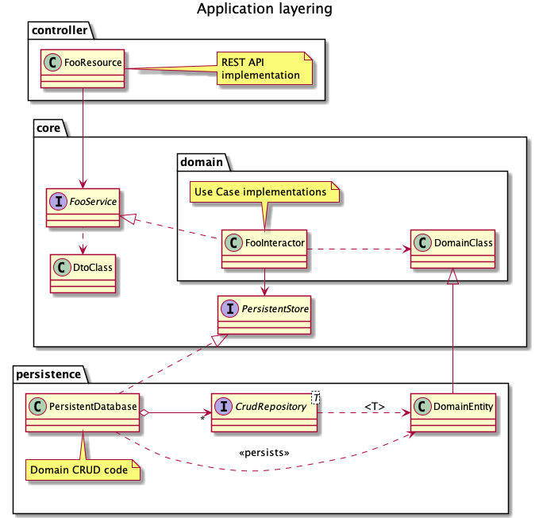
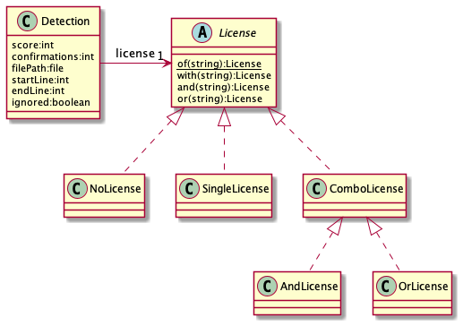

# License Scanner Service Architecture

## Introduction

### Purpose
This document provides a comprehensive architectural overview of the system,
using a number of different architectural views to depict differnt aspects of
the system. It is intended to convey the significant architectural decisions
which have been made on the system.

### Scope
The system is an **experimental** License Scanner service that extracts license
information from software source code and makes this information available to
external client applications.

### Definition, Acronyms and Abbreviations
Term | Description
-----|------------
PURL | Package URL
SPDX | "The Software Package Data Exchange" - An open standard for communicating software bill of material information, including components, licenses, copyrights, and security references. SPDX reduces redundant work by providing a common format for companies and communities to share important data, thereby streamlining and improving compliance.

### References
- [ScanCode Toolkit](https://github.com/nexB/scancode-toolkit)
- [SDPX License list](https://spdx.org/licenses/)

## Goals and constraints
Goals of the License Scanner service are:

1. Source of truth for the license of software packages.
2. Extract this license information automatically from software source code
files.
3. Support human curation of (incorrect or missing) license scanning results.

The stakeholders of this application are:

- Bill-of-Material generators, as a source of curated license information.
- Legal personnel, responsible for correctness of software package licenses.
- CI/CD operators, responsible for running automated build pipelines.

The most significant requirements are:

- License detection shall be based on industry best-practice.
- Service shall run unsupervised with a (fairly) high availability.
- Curation of scan results shall use a graphical user interface.

Design constraints are:

- Maintainability: Code must be easy to maintain for average programmers. This
  is why the code tries to adhere to "Clean Code" guidelines, and a strict
layering model is applied.

## Use-Case view

### Provide package license information
1. A Bill-of-Materials generator encounters a package it needs license
information for, and requests the service for the license related to the
package.
2. The service looks up the license for the indicated package and shares it
with the generator.

### Scan package license from source code
1. A Bill-of-Materials generator encounters a package it needs license
information for, and provides the location of the package source code to the
service.
2. The service downloads the source code and extracts files if the sources are
packaged in an archive..
3. The service scans the source code files and persists the scan results.

_Note that the download and scanning process takes time, and the requesting
generator will not wait for the license scan to complete. The resulting license
information is available the next time the generator requests the license
information for the same package._

### Correct failed scans
1. Service is not able to download the package due to a missing or wrong source
code location, or scanning did no yield any license information.
2. Service lists failed packages.
3. Human curator manually corrects the source location and triggers a new scan,
or manually enters the license based upon research.
4. Service restarts scanning license scanning of the package or stores the
entered license information.

### Curate scanning result
1. Generator contests license information based on a second source (like a
package management repository).
2. Service lists packages with contested licenses to a human curator.
3. Human curator reviews individual license detections and marks
false-positives, or manually overrides the license if the scanner did not
detect that actual license.
4. Service stores the curated license information and clears the contest state.

_Licenses that have been confirmed by the human curator can no longer be
contested by a generator. In such cases the generator must assume the curated
license is correct, and instead ignore its second source._

### Contest curated scanning results
1. Based on an external source, the human curator decides a previously curated
package license is still incorrect.
2. Human curator looks up the package by name.
3. Human curator corrects the overridden license.
4. Service stores the updated license information.

### Use-case realization
The figure below shows how the use-cases map to the system interactions:


## Logical view
### Overview
The license scanner is a stand-aloen service that persists its data in a
relational database and delegates the actual scanning of licenses from source
file to the open source [ScanCode
Toolkit](https://github.com/nexB/scancode-toolkit) command-line tool. (This
includes the "ExtractCode" tool to unpack a number of common archive formats.)

### Package identification
To unambiguously identify packages across multiple clients, the choice was made
to identify packages using [Package
URLs](https://github.com/package-url/purl-spec). Every package is identified by a URI that consists of the following elements:

```
pkg:<type>/[<namespace>/]<name>@<version>
```

Where:

- **type** is the package manager serving the package, like `maven`, `nuget` or
  `npm`. This allows distinguishing packages from disjunct ecosystems with
similar names.
- **namespace** is the optional namespace provided by the package manager. 
- **name** is the name of the package.
- **version** is the version of the package.

(All fields are URL-escaped to avoid collisions with reserved characters in the URI
structure mentioned above.)

### Source location identification
The location of source code is stored in the format used by SPDX documents:

```
[<vcs_tool>+]<transport>://<host>[/<path>][@<version>][#<sub_path>]
```

Where:

- **vcs_tool** is the optional version control system used. If not specified
  the URI is assumed to represent a direct download URL for an archive file
containing the source code.
- **transport** is the transport protocol to be used, like `https` or `git`.
- **host** is the host part of the resulting URL.
- **path** is the path specifiation to the source code archive, like the
  project path in a version control system.
- **version** is the branch or revision tag name within a version control
  system.
- **sub_path** is the sub-path within the extracted source code tree that
  provides the root to the package source code. (This is used for mono-repos
that contain multiple packages.)

(All fields are URL-escaped to avoid collisions with reserved characters in the URI
structure mentioned above.)

## Process view
### Web server
The service runs as a (containerless) web server, allocating a thread per
received web request without tracking sessions. Database access is handled
synchronously by the same thread, and license scan requests are queued for
asynchronous scheduling.

### License scanning
Since scanning source code can for some packages take over half an hour, the
actual scans are handled asynchronously. License scans are therefore queued for
execution by a separate threadpool. License scanning uses a configurable
number of sub-threads to process the files that make up the source code of a
package.

## Deployment view
Although the license data is persisted to an external H2 database, the driver
is included in the executable. This limits deployment to a single binary and a
storage location for the database. (The database schema is included as FlyWay
migrations and a JPA object-relation mapping using Hibernate.)

The external ScanCode Toolkit license scanner requires a Python runtime
environment, and is installed separately. The service expects the `scancode`
and `extractcode` commands to be available from the path.

The web user interface is developed in a separate project, which yields
deployment artefacts that are copied into this project and served as static
resources from the service on port 8080.

All components are packaged in a single Docker container as defined in the
`docker` directory.

## Implementation view
### Overview
The service is coded in Java using Spring Boot to reduce boilerplate code for
web endpoint handling (using Spring MVC) and persistence of data (using JPA on
Hibernate) to a database.

### Layers
The figure below explains how the layers are repesented in the source code:



The implication of this design is that external communication is completely
decoupled from the domain, because the controller layer can only interact with
the domain through a service facade using DTO POJO classes. Domain objects are
never directly exposed to the controller layer.

Persistence is isolated in the same way by providing specialized persistence
instances for domain classes that allow storage and retrieval of domain objects
without polluting the domain with annotations or additional fields.

### Downloading of source code
Prior to scanning, the source code needs to be transferred to the server. This
is handled by a caching downloader with the following class structure:


All requests are passed through the `DownloadCache` by "obtaining" a source
code location before scanning, and "releasing" the location after the scan is
finished. It internally caches the downloaded source code to recycle the
content of monorepos and handle subsequent requests for source files from the
user interface.

If the cache does not hold the requested location, it is passed to the
`Downloader`. It then picks the appropriate `VcsHandler` implementation to
externally retrieve the source code from an external source to the assigned
cache directory.

### External command invocation
ScanCode and ExtractCode are invoked as external shell commands using an
instance of the `ShellCommand` class, which provides a fluent programming model
to define the context for the invocation. If the command does not finish within
the predefined timeout, the shell command is aborted and all spawned
sub-threads are terminated.

The result of the license scan is made available in a JSON file, which is
parsed after the scanner finishes.

### Detections and licenses
A license scan yields `Detection` objects that each represent aggregated proof
for a package license. The information from the license scanner is combined per
license to (heuristically) indicate the most relevant supporting proof, based
on factors like the length of the file fragment and the name of the file.
(E.g.: Filenames containing "license" have priority.) Unlikely sources for
license information (E.g. filenames containing "changelog") are de-prioritized,
and automatically ignored if no additional proof is found.



The class diagram above shows the properties of a `Detection` and the logical
structure of the `License` class to allow matching identical licenses
independent of ordering of elements or the location of braces. (The
`of(string)` method automatically parses a license string into the appropriate
object structure.)

### Persistence of domain objects
To avoid pollution of domain classes by (JPA) persistence annotations, a part
of the ORM configuration is defined in the `orm.xml` file. Whenever additional
fields (like primary keys or additional foreign keys) are necessary for
persistence, subclasses with JPA annotations are used. Instances of these
classes are only created in the persistence layer. This setup avoids all
dependencies from the domain on the selected persistence mechanism.

(End of document)
